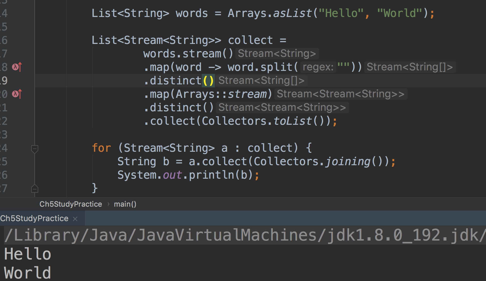

# 스트림 활용

## 1 스트림
* 스트림 개념
> To perform a computation, stream operations are composed into a stream pipeline. A stream pipeline consists of a *source* (which might be an array, a collection, a generator function, an I/O channel, etc), zero or more *intermediate operations* (which transform a stream into another stream, such as filter(Predicate)), and a *terminal operation* (which produces a result or side-effect, such as count() or forEach(Consumer)). Streams are **lazy**; computation on the source data is only performed **when the terminal operation is initiated**, and source elements are **consumed only as needed**.

[JAVA8 Stream docs](https://docs.oracle.com/javase/8/docs/api/java/util/stream/Stream.html)


* Stateful operation & stateless operation
> Intermediate operations are further divided into stateless and stateful operations.   
Stateless operations, such as filter and map, retain no state from previously seen element when processing a new element -- each element can be processed independently of operations on other elements. Stateful operations, such as distinct and sorted, may incorporate state from previously seen elements when processing new elements.    
Stateful operations may need to process the entire input before producing a result. For example, one cannot produce any results from sorting a stream until one has seen all elements of the stream. As a result, **under parallel computation, some pipelines containing stateful intermediate operations may require multiple passes on the data or may need to buffer significant data.** Pipelines containing exclusively stateless intermediate operations can be processed in a single pass, whether sequential or parallel, with minimal data buffering.

[JAVA8 Stream-package docs](https://docs.oracle.com/javase/8/docs/api/java/util/stream/package-summary.html)

## 2 필터링, 슬라이싱
스트림 요소를 선택하고, 크기를 축소하는 방법들을 스트림 API는 제공한다.

* **filter**
	Predicate를 인수로 받아서 일치하는 요소를 포함하는 스트림 반환
	ex> 가격이 10,000원 이하인 메뉴를 고를 때
```java
menus.stream()
	   .filter(menu -> menu.getPrice() < 10000)
     		...
```
* **distinct**
	고유 요소로 이루어진 스트림을 반환. 고유 여부는 스트림에서 만든 객체의 hashCode, equals로 결정.
	ex> 물건 항목의 이름을 중첩되지 않게 확인하고자 할 때
```java
items.stream()
	   .map(Item::getName)
       .distinct()
     		...
```

* **limit**
	주어진 사이즈 이하의 크기를 갖는 새로운 스트림을 반환한다.
	ex> 10,000이하인 메뉴 3개까지만 필요할 때
```java
menus.stream()
	   .filter(menu -> menu.getPrice() < 10000)
	   .limit(3)
     		...
```

* **skip**
	처음 n개 요소를 제외한 스트림을 반환한다(skip(n)).
    ex> 필터를 적용한 메뉴에서 앞의 3개는 제외하고자 할 때
```java
menus.stream()
	   .filter(menu -> menu.getPrice() < 10000)
	   .skip(3)
     		...
```

## 3 매핑
map과 flatMap메소드는 특정 데이터를 선택하는 기능을 제공한다.
함수 적용 결과 새로운 요소로 매핑할 때, 수정보다는 새로운 것을 만드는 개념에 가깝기에 '변환에 가까운 매핑'이라 할 수 있다.

flatMap은 생성된 스트림을 하나의 스트림으로 평면화할 수 있다.
즉, 스트림의 각 값을 다른 스트림으로 만든 다음에 모든 스트림을 하나의 스트림으로 연결하는 기능을 수행한다.

## 4 검색 및 매칭
* 쇼트서킷 : 모든 스트림 요소를 처리하지 않고도 결과 반환 가능.
    * anyMatch : 주어진 스트림에서 적어도 하나 프레디케이트와 일치하는지 검사
    * allMatch : 모든 요소가 프레디케이트와 일치여부 검사
    * noneMatch : allMatch와 반대 연산
    * findAny, findFirst 등

* Optional
값의 존재여부 표현하는 컨테이너 클래스.
값이 존재하는지 확인하고, 값이 없을 때 어떻게 처리할 것인지 강제하는 기능을 제공.

## 5 리듀싱
리듀싱 연산 : 모든 스트림 요소를 처리해서 값으로 도출. 마치 종이를 작은 조각이 될 때까지 반복해서 접는 것과 같아, **폴드** 라고도 불림.

ex>
```java
int sum1 = numbers.stream().reduce(0, Integer::sum);

Optional<Integer> sum2 = numbers.stream().reduce((a,b) -> (a + b));
```

cf) map과 reduce를 연결하는 기법을 *map-reduce 패턴* 이라고 하며, 쉽게 병렬화하는 특징 있음.

## 6 기본형 특화 스트림
* 자바 8에서는 세 가지 기본형 특화 스트림(primitive stream specialization)을 제공.
* IntStream, DoubleStream, LongStream이 그 세 가지며, 박싱 과정에서 일어나는 효율성과 관련 있음.
* mapToInt, mapToDouble, mapToLong과 같은 메소드를 통해서 각각 IntStream, DoubleStream, LongStream 반환.
* max, sum과 같은 숫자 관련 리듀싱 연산 수행 메소드 제공.
* 기본형 특화 스트림에서는 .boxed() 메소드를 호출함으로 숫자 스트림 -> 스트림 변환 가능.
* Stream<Integer>에서 Optional<Integer>있듯, IntStream에서 OptionalInt 존재.
* .rangeClosed(1, 100), .range(0, 101)처럼 특정 범위 숫자 생성 가능.

## 7 무한 스트림
요청할 때마다 값을 생산할 수 있으며 끝이 없으므로, 무한 스트림을 만든다. 이러한 스트림을 언바운드 스트림이라고 표현한다.
무한한 크기의 스트림이기에, limit을 사용해서 명시적으로 스트림의 크기를 제한해야한다. 그렇지 않으면, 최종연산 수행 시 아무결과도 계산되지 않으며 정렬 및 리듀스를 수행할 수 없다.
* iterate
	초기값과 람다를 인수로 받아서, 새로운 값을 끊임없이 생산할 수 있다.
* generate
	iterate와 달리 생산된 각 값을 연속적으로 계산하지는 않는다.
	
## 연습문제

[풀어보기](./Ch5Practice.java)


## 추가사항 (19.01.24)

다음 코드에 대한 자료구조 이해를 원하는 팀원의 요청으로, 설명 추가


```java
List<String> words = Arrays.asList("Hello", "World");
        
        List<Stream<String>> collect =
                words.stream()
                .map(word -> word.split(""))
		.distinct()     // 내부 동작 확인용으로 추가
                .map(Arrays::stream)
                .distinct()
                .collect(Collectors.toList());

```

이에 대한 설명 이미지는 다음과 같다.


이를 IDE(IntelliJ)에서 확인한 자료구조 및 출력 형태는 다음과 같다.




